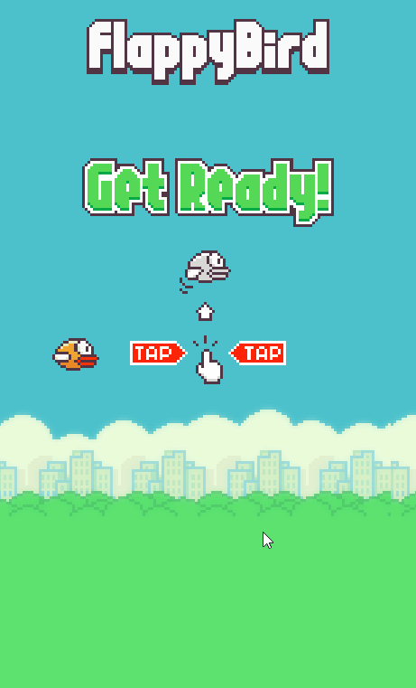

# Flappy Bird Pixi

This project is a simple implementation of the Flappy Bird game using the Pixi.js library. It serves as an example of how to create a basic game using TypeScript and Pixi.js.

You can play the game on your browser by visiting [here](https://flappy-bird-rlve7v36e-luiz-henrique-harsches-projects.vercel.app/).

  

The project is structured as follows:

- `public/`: Contains static assets (images only, for now) used in the game. Every sprite is packed in `flappy-bird-atlas.png` and its corresponding `flappy-bird-atlas.json` file.

- `src/`: Contains the TypeScript source code for the game. The code is organized in folders based on functionality:
  - `entities/`: Contains classes for game entities such as `Bird` and `Pipe`.
  - `scenes/`: Contains classes for different game scenes. In this project, there is only the `MainScene`.
  - `utils/`: Contains utility functions and classes
  - `constants.ts`: Data layer. Contains constant values used throughout the game.
  - `types.ts`: Contains TypeScript type definitions.
  - `Game.ts`: The main game class responsible for managing the game loop, scenes, and overall game state.
  - `main.ts`: The entry point of the application, where the app is initialized and started.

### Development considerations

- The project is structured to be simple but scalable.
- Game variables like `pipeSpeed`, `tapStrength`, and others are defined in `constants.ts` under the "DESIGN" section for easy tweaking and balancing.
- The game architecture is based on standard engine design, so expect to see scenes, entities, update and destroy methods, etc.
- The Event Bus design pattern is used to manage communication between different parts of the game, allowing for loose coupling and easier maintenance.
- Collision is detected through simple AABB logic, which is sufficient for this use case.
- For simplicity, the game supposes that the window won't be resized during gameplay, so pipes and backgrounds are generated based on the initial window size. In a production game, it would be necessary to handle window resizing and adjust the game elements accordingly.
- Some game state variables are used globally. In a real game, it would be better to encapsulate game state within a dedicated class to allow for better management and scalability, making dependencies more explicit.